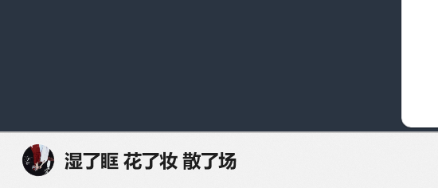
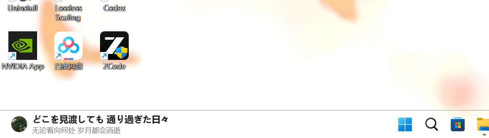
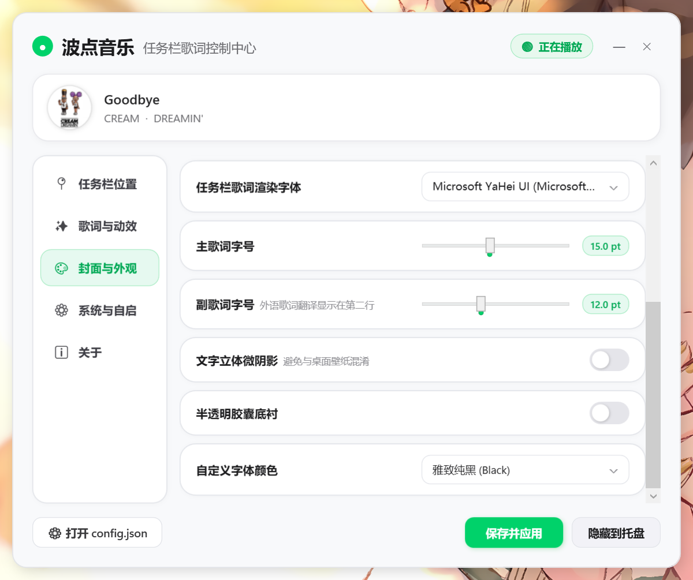

# 波点音乐 - 任务栏歌词
### BodianTaskbarLyric

专为 **波点音乐 (Bodian Music)** 桌面端深度打造的 Windows 10 / 11 极简、轻量、沉浸式任务栏歌词工具。

---

## 项目介绍

市面上已经存在一些优秀且知名的任务栏歌词工具，但由于 **波点音乐** 相对小众，且官方桌面客户端**未向 Windows 系统暴露任何媒体传输信息 (SMTC)**，导致常规工具难以获取播放进度与歌词，目前主流项目均未对其进行适配。

因此本项目针对波点而生。

---

## 效果展示

  

---

## 功能实现

- 同步实时播放进度
- 自定义位置、字体、大小、颜色、动画效果等，封面显示
- 支持双语翻译歌词
- 自适应隐藏
- 轻量化

---

## 下载使用

1. 前往 [Releases 页面](https://github.com/weiwei221206/BodianTaskbarLyric/releases)下载
2. 解压至任意目录，运行 `BodianTaskbarLyric.exe`。
3. 打开波点音乐客户端播放歌曲，歌词即可自动在任务栏展示
4. **双击托盘图标**：打开/隐藏详细设置面板。

---